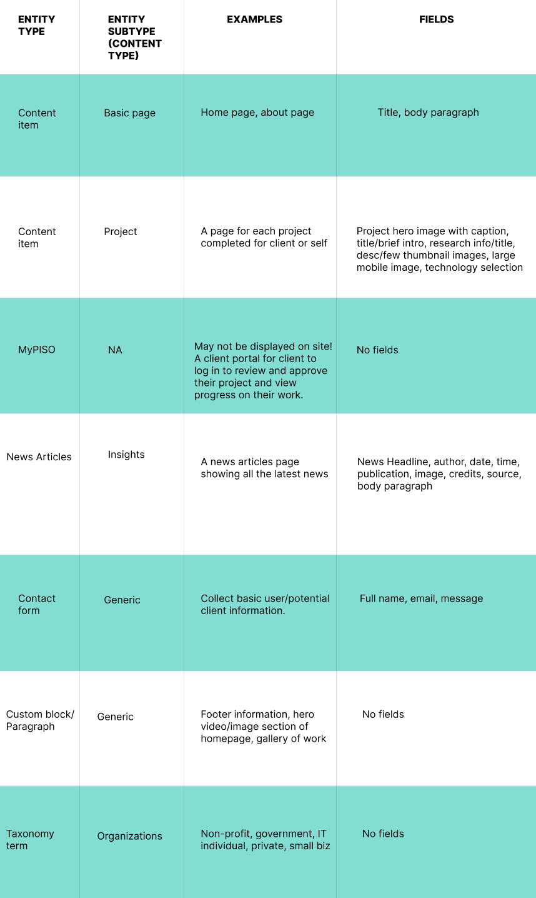
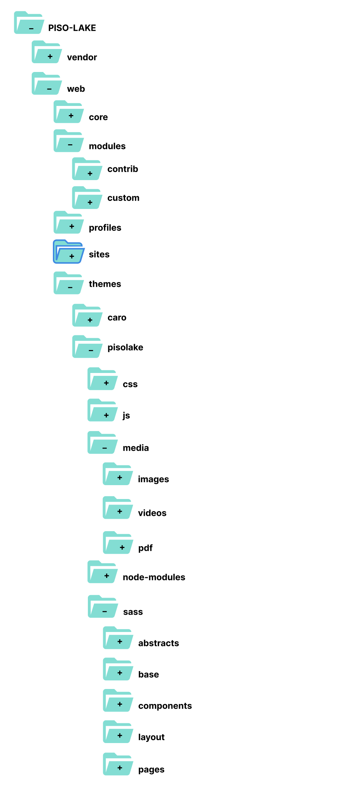
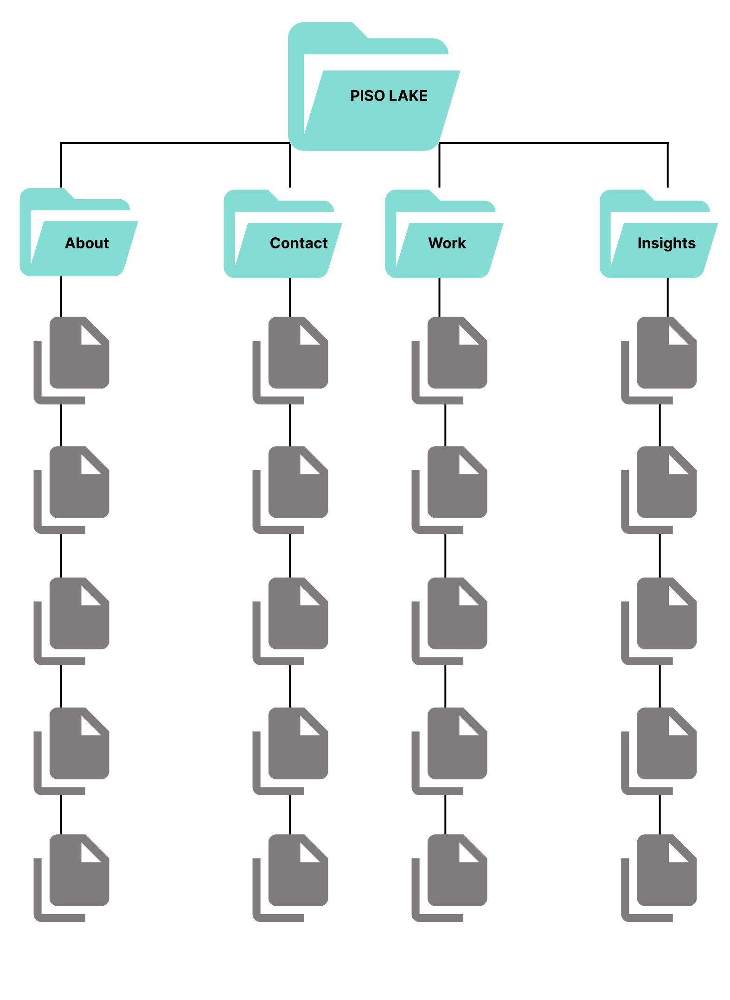
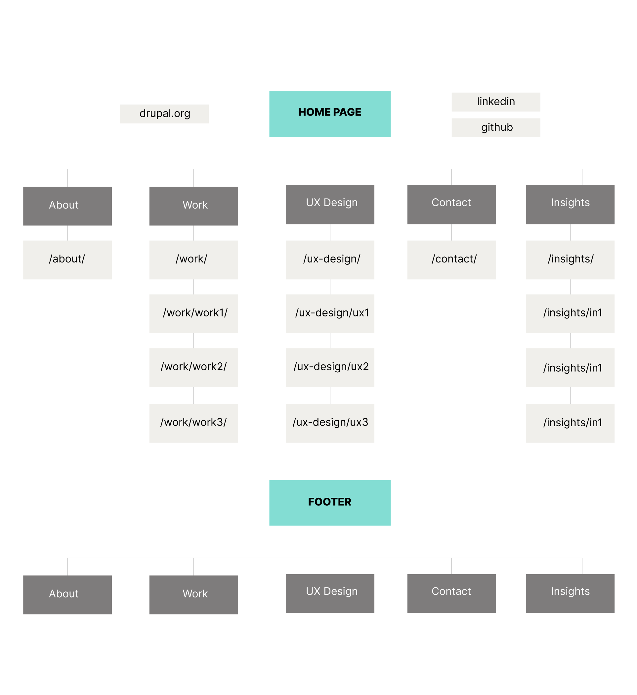

# DOCUMENTATION v1.0

## PISO Website Project

Description - This is my portfolio website, designed to showcase my projects for clients as well as personal projects undertaken during my free time. Additionally, I'm planning moving the portfolio from WordPress to Drupal entirely. This change would allow me to build and incorporate advanced functionalities with custom modules as I consider expanding into side geek:.

## Website Url
www.pisolake.com

## Update

This website project is updated regularly, with the addition of essential functionalities and features to enhance user interaction and experience. These improvements are largely based on research aimed at addressing specific user needs, ensuring they have the best possible online experience.

## Future Plan

Having grown fond of Drupal as my preferred platform for building websites and other digital solutions, the process of integrating Drupal into this portfolio website has begun. Although still in the initial stages of planning and designing the overall UX/UI experience, the ultimate aim is to transition to the Drupal platform as soon as feasible, to capitalize on Drupal's extensive functionalities and capabilities.

## Technology

This portfolio website utilizes modern web technologies to offer users a richer experience. Among the technologies used: JavaScript/jQuery, HTML5 + CSS3, SASS, MySQL, and WordPress. I am preparing to move this to Drupal entirely.

## UX/UI Design Tool

-	Figma: Primary UX/UI design tool.
-	Adobe XD: Secondary UX/UI design tool.
-	Photoshop: Used exclusively for image processing.

## PISO IA - Information Architecture

## Disclaimer

I appreciate your visit and interest in my project repository. However, all contents of this project are reserved. Should you wish to utilize any of features, please seek appropriate permission. Furthermore, this repository should not be used for malicious purposes or intents.
